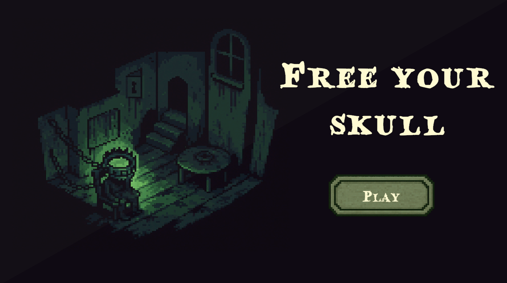
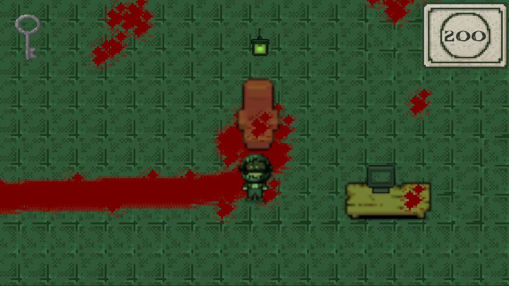
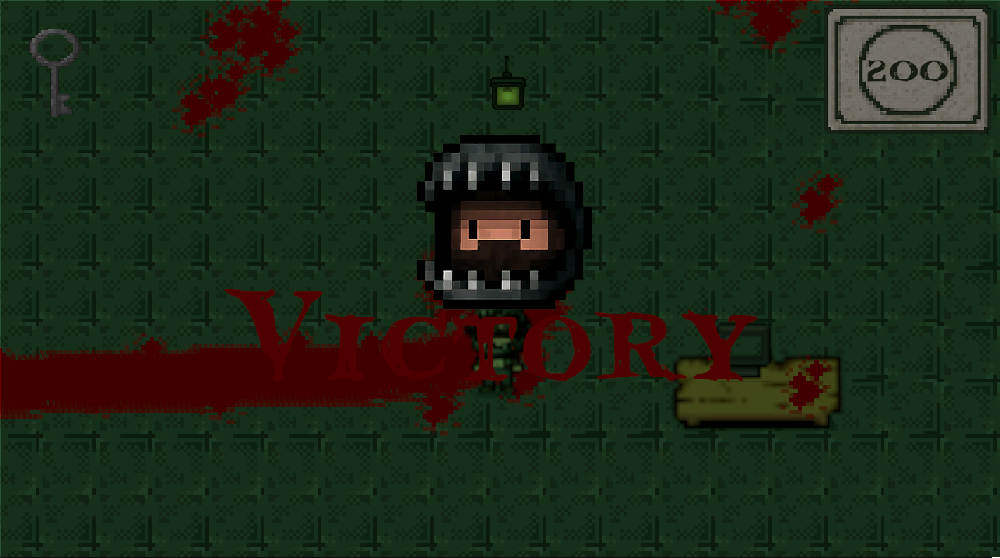
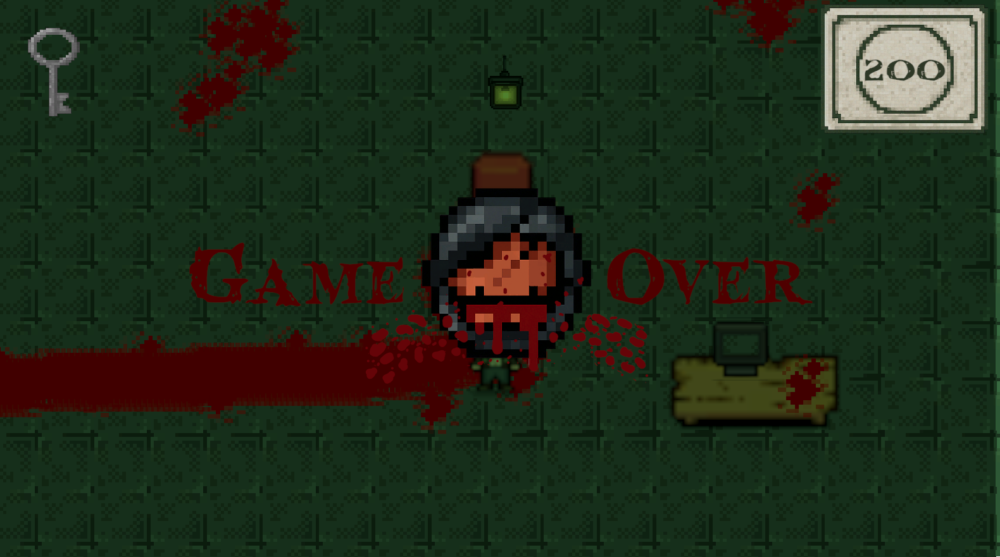

# 🔑 FREE YOUR SKULL

**FREE YOUR SKULL** es un videojuego en 2D estilo pixel art con estética lúgubre, inspirado en el suspenso y la tensión de películas como *Saw*. El jugador se encuentra atrapado en una habitación oscura, donde deberá resolver acertijos y recolectar objetos clave para sobrevivir... o morir.

---

## 🎮 Mecánicas del Juego

- **Movimiento:** Usa `W`, `A`, `S`, `D` para moverte por el entorno.
- **Interacción automática:** Si te acercas a un objeto interactuable, el personaje interactuará automáticamente.
- **Objetos clave:** Recolecta elementos que te permitirán avanzar, como partes de acertijos o piezas fundamentales para conseguir **la llave** que te salvará la vida.

---

## 🔧 Tecnologías Utilizadas

- **Motor:** Unity 2D
- **Lenguaje:** C#
- **Arte:** Pixel Art
- **Plataforma:** itch.io

---

## 🚀 Cómo Jugar

1. Descarga o clona este repositorio.
2. Ábrelo con Unity (versión recomendada 2021.3 o superior).
3. Ejecuta la escena principal y comienza tu escape.

---

## 📌 Notas

- El juego aún está en desarrollo, se seguirán agregando nuevas salas, acertijos y mejoras en la interfaz.

---

## 🧠 Créditos

Desarrollado por:

- Juan Acosta - GameDeveloper
- July Rodriguez - GameDeveloper
- Juanita Garcia - GameDeveloper
- Gustavo Leon - UX/UI

---

## 📷 Screenshots
### 🧭 Main Menu

### 🐉 Gameplay

### 🚀 Victory screen

### ☠️ Gameover screen

---

> “¿Podrás encontrar la llave a tiempo? La vida de tu personaje depende de ello...”
